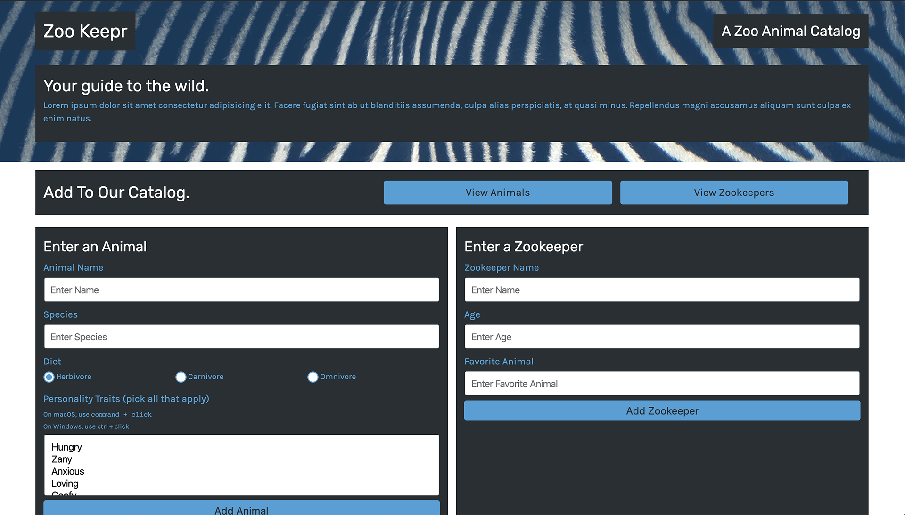

# zookeepr-Express-js

## Purpose
A local zoo application that allows users to access data of animals and zookeepers. Users can also add new animals and zookeepers at this app.  

## Built With:

- HTML
- CSS
- Javascript
- Express.js
- JEST

## Deployed Website on Heroku:

Lauch at [here](https://zoo-keepr-2022.herokuapp.com/)

## Contribution

Made by Wenwen Tian
